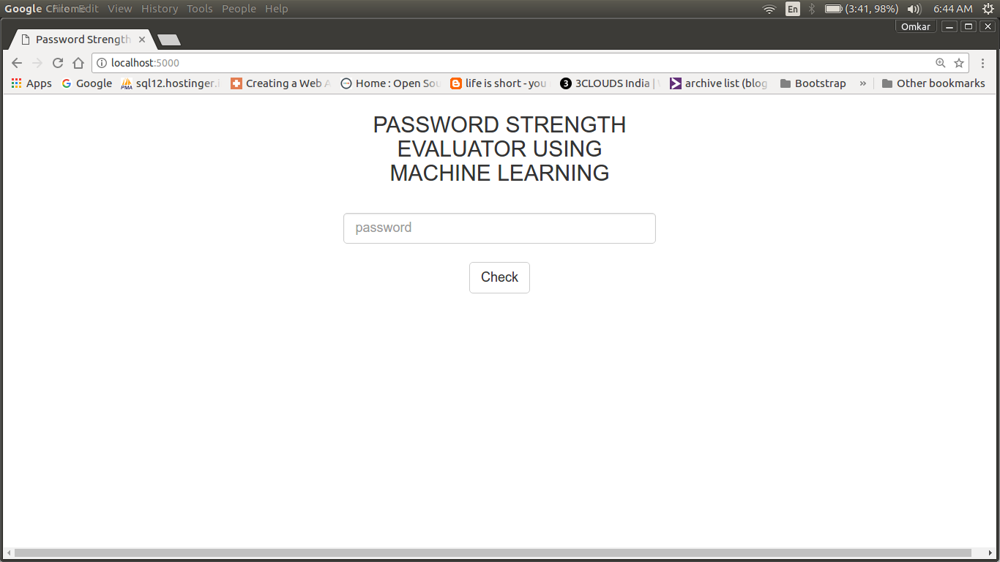
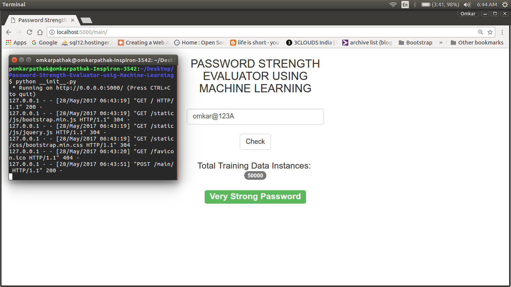

# Password-Strength-Evaluator-using-Machine-Learning

Course: Principles Of CyberSecuirty
Course Number: 7020C

Project Contributors:

- Siri Chandana Gangavarapu
- Sai Priya Chundi

Steps to Execute:
-   make sure you have flask installed, if not enter the following command in terminal:
`pip install Flask`.
- Next, you need `scikit-learn`, which is a data mining tool in Python. Install it by typing:
`pip install -U scikit-learn`. 
-   After installing flask, extract the contents in a folder and then run the `__init__.py` file.
-  Server runs at `localhost:5000`, type this address in the browser and see the SVM in action.

